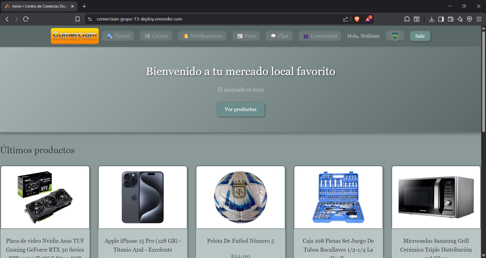

# Comercium




## Equipo de desarrollo

- [Brian Guzmán](https://steamcommunity.com/profiles/76561199212464163) - Líder | Backend | Frontend | Investigación
- [Gonzalo Rosales](https://www.linkedin.com/in/gonzalo-rosales-325a45296/) - Frontend | Tester | Investigación
- [Facundo Martel](https://www.linkedin.com/in/facundo-martel-078683324/) - Tester | Backend | Errores |Investigación


---

## Comercium

El mercado digital enfocado en facilitar la compra, venta e intercambio de bienes dentro de una comunidad local sin comisiones altas. Mucha gente quiere vender o intercambiar cosas en su comunidad sin pagar comisiones altas a plataformas grandes.
La solución es un espacio simple y funcional con publicación de productos, chat en tiempo real, gestión de usuarios y pagos digitales integrados.

---

## Requisitos

- **Git**
- **Python 3.10**
- **Visual Studio Code** con extensiones de **Python**

---

## Instalación modo desarrollo

## Pasos previos

En GitHub, ir a **Code** -> **Download ZIP**

Una vez descargado el proyecto, **extraer** en una carpeta, luego abrir Visual Studio Code.

**Visual Studio Code:**

**File** -> **Open Folder** -> **Comercium-grupo-13**

Dentro de la carpeta raíz, crear un archivo llamado **.env** y copiar todo lo que está dentro de **.env.example** reemplazando los campos con **[brackets]** y llenando los campos vacíos con información correspondiente.

## Consola

Abrir una terminal con **CTRL + Ñ**

Abrir una consola **Command Prompt** y escribir uno por uno los siguientes comandos:

```bash
py -3.10 -m venv .venv
```

```bash 
.venv\Scripts\activate
```

```bash 
python --version
```

```bash 
python -m pip install --upgrade pip
```

```bash 
python -m pip install -U pip setuptools wheel
```

```bash 
python -m pip install -r requirements.txt
```

```bash
python manage.py migrate
```

```bash
python manage.py runserver
```

---

### Características especiales de este template

- **Estilo RETRO** muy hermoso, una obra de arte
- **Foco en intercambio comunicacional entre usuarios** además de compra/venta tradicional
- **Integración con MercadoPago**
- **Chat interno** entre usuarios para negociación directa
- **Chat general** para la comunicación colectiva de la comunidad

---

## Funcionalidades que trae

- **Registro e inicio de sesión** con autenticación social (Google)
- **Gestión de productos**: crear, editar, eliminar y listar con filtros por categoría y precio
- **Carrito de compras** con gestión de cantidades y checkout integrado con MercadoPago
- **Chat interno** entre usuarios para coordinar ventas/intercambios
- **Perfiles de usuario** con avatar y biografía personalizados
- **Presencia en línea** y auto-logout por inactividad
